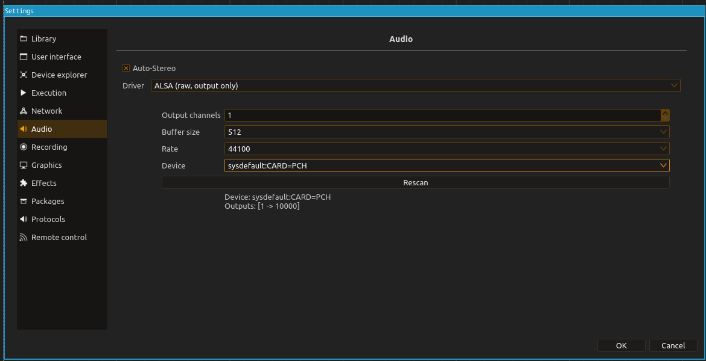

# How do you run ossia in a docker ?
## Build your own image (optional)
Get the Dockerfile for your `ossia-docker`. If you want to add stages - e.g. installing some extra python modules - follow the given guidelines:
<br>
* the new stage(s) is/are needed prior to the build of ossia : 
  * add the stage prior to `FROM score-dock as score-final` ;

* the build of ossia can be done without the new stage(s) : 
  * add the stage prior at the end of the dockerfile, before the entry point.

* cache the rules that download new packages/modules in case you need to re-run your build like so:
  
```docker
  RUN \
    --mount=type=cache,target=/var/cache/<cache-name> \
    <package-manager> install <package>
```

Then, build your image:
``` bash
docker build -t ossia-docker:<version> .
```
## Use a docker image

First, to be able to have the gui on your machine, run the following in a terminal:
```bash
xhost +local:
```

Get yourself an image of `ossia-docker` either by following the first section of this readme or by running the following comand :
```bash
docker pull grybouilli/ossia-docker:torch-n-audio
```

Then, to run the image, execute the following line in a terminal:
```bash
docker container run --gpus all --rm --net host -v /tmp/.X11-unix:/tmp/.X11-unix -v /dev/snd:/dev/snd --privileged -it ossia-docker:torch-n-audio
```

To get the audio working, in ossia, go to `Settings>Settings>Audio` and change the driver to ALSA. Try out the different devices until you find one that works



And now you're good to go ! 
